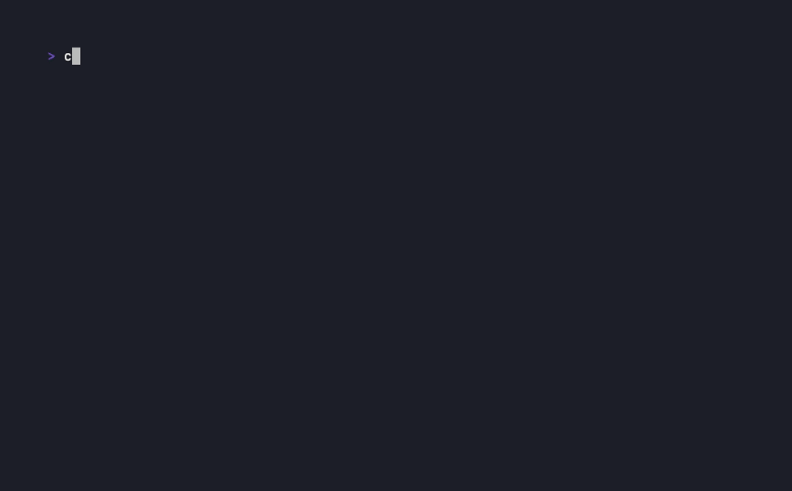

# lazyshell

`lazyshell` est un gestionnaire de sessions shell à la `tmux`/`screen`, avec une
interface TUI à deux panneaux dans l'esprit de `lazygit`/`lazydocker` : la liste
de vos sessions à gauche, la sortie en direct de celle qui est sélectionnée à
droite. Les sessions continuent de tourner en arrière-plan — historique conservé
— même pendant que vous en regardez une autre.

Le panneau de sortie est un véritable émulateur de terminal : les applications
plein écran fonctionnent, `vim`, `htop` et `less` tournent à l'intérieur d'une
session, curseur et couleurs compris.



🇬🇧 **English version of this document: [`README.md`](../README.md) (the
reference version).**

📖 **Documentation en ligne : [thomas-gleizes.github.io/lazyshell](https://thomas-gleizes.github.io/lazyshell/)**
— installation, utilisation, configuration, sessions d'agents IA et configuration
de projet, en [français](https://thomas-gleizes.github.io/lazyshell/fr/) et en
[anglais](https://thomas-gleizes.github.io/lazyshell/en/). Les sources du site
vivent dans `site/`.

## Installation

Binaire précompilé, sans toolchain Go : télécharger l'archive de son OS/arch
depuis la [page des releases](https://github.com/thomas-gleizes/lazyshell/releases),
vérifier `checksums.txt`, puis extraire `lazyshell` dans un dossier de son `PATH` :

```sh
tar xzf lazyshell_<os>_<arch>.tar.gz
sudo mv lazyshell /usr/local/bin/
lazyshell --version
```

Ou, pour que ce téléchargement/vérification/extraction soit fait pour vous
(Linux et macOS, amd64/arm64) :

```sh
curl -fsSL https://raw.githubusercontent.com/thomas-gleizes/lazyshell/main/scripts/install.sh | bash
```

Avec Go installé :

```sh
go install github.com/thomas-gleizes/lazyshell/cmd/lazyshell@latest
```

Ou depuis les sources :

```sh
git clone https://github.com/thomas-gleizes/lazyshell.git
cd lazyshell
make build   # produit ./bin/lazyshell
```

### Mise à jour

`lazyshell update` remplace le binaire installé par la dernière release — le
même téléchargement, la même vérification de somme de contrôle et la même
installation que `scripts/install.sh`, depuis le binaire lui-même :

```sh
lazyshell update           # installe la dernière release
lazyshell update --check   # dit seulement s'il y en a une plus récente
```

Le nouveau binaire est écrit à côté de l'ancien puis mis en place d'un seul
geste : une mise à jour interrompue laisse l'ancienne version intacte, jamais
une moitié de l'une ou de l'autre. Lancer la commande depuis un lazyshell en
cours ne pose pas de problème — les sessions déjà ouvertes gardent la version
avec laquelle elles ont démarré, donc relancez lazyshell pour utiliser la
nouvelle.

Deux cas où elle s'arrête en le disant plutôt qu'en agissant :

- Le dossier du binaire n'est pas modifiable (c'est le cas de `/usr/local/bin`
  en général). Relancez avec `sudo $(command -v lazyshell) update`.
- La version installée n'est pas une release publiée — un `go install` depuis
  `main`, ou un `make build` local. La remplacer par une release jetterait ce
  que vous avez compilé, donc elle demande `lazyshell update --force`.

`--force` réinstalle aussi quand vous êtes déjà à jour. Windows n'a pas de
build de release (ni de lazyshell) : la commande refuse avant tout
téléchargement.

## Utilisation

Lancer `lazyshell` dans un terminal. `Tab` change le panneau actif entre la liste
des sessions et le panneau de sortie, et `→` / `←` font la même chose de façon
directionnelle. Le pass-through — les frappes qui vont directement au shell de
la session sélectionnée — est l'état par défaut dès qu'une session est
sélectionnée : rien à presser avant. `Ctrl+O` (ou deux `Esc` d'affilée)
verrouille le panneau de sortie à la place, pour défiler, chercher ou copier ;
`i` / `Entrée` reprend la saisie. Appuyer sur `?` à tout moment ouvre une aide
dans l'application, qui liste tous les raccourcis ci-dessous.

| Touche | Action |
| --- | --- |
| `q` / `Ctrl+C` | Quitter lazyshell |
| `Tab` | Changer de panneau actif |
| `→` | Aller au panneau de sortie |
| `?` | Afficher l'aide |
| `j` / `↓` | Session suivante |
| `k` / `↑` | Session précédente |
| `n` | Nouvelle session |
| `x` / `d` | Tuer la session sélectionnée |
| `D` | Supprimer définitivement la session sélectionnée (retirée du panneau) |
| `r` | Renommer la session sélectionnée |
| `c` | Dupliquer la session sélectionnée |
| `N` | Nouvelle session en demandant son nom (vide = nom automatique) |
| `M` | Nouvelle session dans un dossier choisi |
| `w` | Exporter le scrollback de la session sélectionnée vers un fichier |
| `b` | Marquer/démarquer la session pour la diffusion (broadcast) |
| `B` | Sauter à la prochaine session d'agent bloquée |
| `g` | Affecter la session sélectionnée à un groupe, choisi dans une liste ou tapé au clavier |
| `G` | N'afficher que le groupe de la session sélectionnée ; à nouveau pour annuler |
| `A` | Marquer tout le groupe pour la diffusion, ou le démarquer |
| `X` | Tuer toutes les sessions du groupe |
| `W` | Relancer les sessions terminées du groupe |
| `F12` | Afficher/masquer le panneau de debug (ne fait quelque chose qu'avec `--debug`) |

Quand c'est le **panneau de sortie** qui a le focus, ce sont ces touches-ci qui
s'appliquent :

| Touche | Action |
| --- | --- |
| `←` | Revenir à la liste des sessions (seulement quand verrouillé) |
| `Ctrl+O` (configurable) | Verrouiller le panneau : sortir du pass-through pour défiler, chercher ou copier |
| `Esc` `Esc` | Pareil, sans touche à apprendre : deux Échap d'affilée, en moins de 400 ms |
| `i` / `Enter` | Reprendre la saisie : retour au pass-through (utile seulement une fois verrouillé) |
| `PgUp` / `PgDn` | Défiler d'un écran dans l'historique |
| `Ctrl+U` / `Ctrl+D` | Défiler d'un demi-écran |
| `/` | Rechercher dans l'historique ; `n` / `N` pour l'occurrence suivante/précédente |
| `v` | Démarrer (ou étendre) une sélection de lignes — mode copie |
| `y` ou un second `v` | Copier la sélection (OSC 52, ou la commande de repli configurée) |
| `{` / `}` | Sauter au prompt précédent/suivant (nécessite l'intégration shell OSC 133) |
| `Y` | Copier la sortie de la dernière commande terminée (nécessite l'intégration shell OSC 133) |
| `Esc` | Quitter la recherche ou annuler la sélection en cours |

Démarrer une session (`n`, `N`, `c`) ou en relancer une (`R`) vous dépose
directement dedans : le panneau de sortie prend le focus, le pass-through est
armé, on peut taper tout de suite. Déplacer la sélection avec `j` / `k` (ou un
clic, ou la molette) est de la navigation, et reporte l'état courant : changer
de session en étant verrouillé vous y dépose verrouillé, changer en étant
déverrouillé vous y dépose prêt à taper.

L'exception est une session dont l'état a été tranché — une session pour
laquelle un fichier de projet a déclaré `locked:` (voir
[Configuration de projet](#configuration-de-projet) : une `command:` déclarée
démarre verrouillée par défaut), ou une session que vous avez verrouillée ou
déverrouillée à la main. Ce choix est mémorisé par session : un `npm run dev`
que vous gardez verrouillé le reste à chaque fois que vous y revenez, quoi que
vous fassiez sur la session d'où vous venez.

`Ctrl+O` verrouille le panneau — la même touche, quelle que soit la session
sur laquelle vous êtes passé entre-temps. Deux `Esc` d'affilée, à moins de
400 ms l'un de l'autre, verrouillent aussi — le geste qu'on trouve sans lire
ce tableau. C'est un vrai double appui : le premier `Esc` part dans la session
comme n'importe quelle touche, donc `Esc` continue de marcher dans `vim` et
dans une session d'agent, et toute autre touche tapée entre les deux casse la
paire. La seule habitude qui n'y survit pas est le double `Esc` réflexe de
`vim`, qui verrouillera le panneau ; `Ctrl+O` reste le verrouillage pour qui
préfère l'éviter.

Un shell qui se termine de lui-même — `exit`, `Ctrl+D`, ou ce qu'il faisait
tourner qui se finit — emmène l'interface avec lui : le panneau se verrouille
et le focus revient au panneau des sessions, sur cette même session. Elle
reste sélectionnée et listée, terminée, donc `R` la relance (et vous y dépose
à nouveau déverrouillé) et `x` / `D` s'en débarrassent. Rien ne se passe
derrière une popup : une confirmation ou l'aide gardent le focus qu'elles ont.

Chaque panneau porte aussi ses touches les plus utilisées sur la ligne du bas de
son cadre, pour que les plus courantes soient lisibles sans ouvrir `?`. La liste
se raccourcit à ce qui tient dans la largeur du panneau, et celle du panneau de
sortie s'adapte à ce qu'il fait : le retour au pass-through quand verrouillé,
le verrouillage quand en pass-through, aucune indication de défilement quand
une application plein écran tient la session.

### Lire la liste des sessions

Chaque session tient sur une ligne : une gouttière de quatre colonnes, puis son
nom, son état, son PID, et soit le titre de terminal posé par le shell
(généralement la commande en cours), soit son répertoire de travail.

| Marqueur | Signification |
| --- | --- |
| `!` | La session a sonné la cloche pendant que vous regardiez ailleurs. Effacé quand vous la sélectionnez. |
| `#` | Une application plein écran (`vim`, `htop`, `less`) tient la session. Affiché `[ALT]` dans la barre d'état pour la session sélectionnée. |
| `●` | La session a produit de la sortie alors qu'elle n'était pas à l'écran. Effacé quand vous la sélectionnez. |
| `+` | La session est marquée pour la diffusion — voir ci-dessous. |

Une session sans agent dont le shell a l'[intégration shell OSC
133](#intégration-shell-osc-133) activée affiche aussi `✗ <code>` devant son
titre/répertoire une fois que sa dernière commande a échoué — une session
d'agent porte déjà son propre marqueur d'état à la place, donc ça ne fait
jamais doublon avec lui.

Une session déclarant [`restart:`](#configuration-de-projet) affiche
`↻<compteur>` devant son titre/répertoire dès qu'elle a eu besoin d'au moins
un redémarrage automatique — effacé dès qu'un redémarrage tient assez
longtemps pour être considéré comme sain à nouveau.

### Groupes

Une session appartient à un groupe, ou à aucun. Les sessions groupées sont
affichées sous une ligne d'en-tête qui nomme le groupe, ce qui est précisément
ce qui rend lisible une liste de huit sessions d'agents IA : on voit d'un coup
d'œil lesquelles travaillent sur le même chantier. Les en-têtes sont purement
visuels — ils ne sont ni sélectionnables, ni cliquables, ni repliables, et
`j` / `k` passent directement par-dessus.

L'ordre est : les groupes déclarés par le fichier de projet, dans l'ordre où il
les déclare, puis les groupes créés à chaud dans leur ordre de première
apparition, puis les sessions sans groupe en dernier. Un groupe dont aucune
session n'est visible n'affiche aucun en-tête, donc un filtre qui masque tout un
groupe ne laisse pas de case vide derrière lui. Sans aucun groupe, il n'y a
aucun en-tête : la liste est exactement celle, plate, qu'elle a toujours été.

Déclarez les groupes et affectez-y les sessions dans `lazyshell.yml` (voir
[Configuration de projet](#configuration-de-projet)), ou posez-en un à tout
moment avec `g`, qui ouvre une liste : tous les groupes déjà utilisés, plus
« sans groupe » et « + nouveau groupe… » pour un nom qui n'y figure pas
encore. Quatre touches agissent ensuite sur tout le groupe de la
session sélectionnée : `A` y diffuse, `X` le tue, `W` relance celles de ses
sessions qui se sont terminées, et `G` restreint la liste à lui. Une action de
groupe atteint toujours tous ses membres, y compris ceux qu'un filtre masque —
« tuer le groupe » veut dire le groupe, pas la partie visible à l'écran.

`W` saute les sessions encore en cours plutôt que de refuser d'agir : un groupe
en partie terminé et en partie vivant est le cas normal. Contrairement au `R`
d'une seule session, il ne vous donne pas le clavier ensuite.

Les agents pilotent tout cela par le socket de contrôle — voir
[API de contrôle par les agents](#api-de-contrôle-par-les-agents).

### Diffusion (broadcast)

Marquer deux sessions ou plus avec `b`, puis s'attacher à l'une d'elles (`i` /
`Enter`) : chaque frappe part désormais vers toutes en même temps, pas seulement
vers celle que vous regardez. La barre d'état porte un avertissement
`⚠ BROADCAST → N sessions` tant que c'est armé, devant tout ce qu'elle dirait
autrement — c'est le seul état où une frappe dont on n'attend rien peut
atteindre plusieurs shells dans votre dos, alors il reste visible quoi qu'il
arrive. Démarquer une session (`b` à nouveau) la retire ; la diffusion s'arrête
d'elle-même dès qu'il en reste moins de deux marquées.

### Souris

Active par défaut. Cliquer une session la sélectionne — c'est de la navigation,
donc ça ne donne *pas* le clavier au shell ; le double-clic, si. La molette fait
défiler le contenu du panneau de sortie, et jamais l'historique de commandes du
shell : `lazyshell` traite la molette lui-même au lieu de laisser le terminal la
transformer en flèches, ce qui, à une invite, rappellerait la commande
précédente au lieu de défiler. Cliquer-glisser sélectionne des lignes, puis `y`
copie — relâcher le bouton ne copie rien tout seul.

Un programme dans une session ne reçoit la souris qu'une fois qu'il l'a demandée
(`vim` avec `set mouse=a`, `htop`) ; un shell ou une CLI d'agent IA ne la demande
jamais, donc la molette continue de faire défiler le scrollback. Mettre
`mouse.forward_to_app: false` garde la souris pour `lazyshell` quoi qu'il arrive.

Le seul coût d'avoir la souris activée : `Shift-Up` et `Shift-Down` ne sont plus
transmis à la session. `gocui` donne à ces touches et aux boutons de la souris
les mêmes valeurs, donc les deux ne peuvent pas marcher ensemble — voir
l'[ADR 0003](adr/0003-souris.md). Mettre `mouse.enabled: false` les récupère, au
prix des gestes ci-dessus.

Tant qu'une application plein écran a le contrôle, remonter dans l'historique —
et le mode copie, qui sélectionne dans ce même historique — est désactivé :
l'écran alternatif n'alimente pas le scrollback, et ces touches appartiennent à
l'application. `lazyshell` ne change jamais de mode tout seul : utiliser `i` ou
`Enter` pour donner le clavier au shell, et la touche de préfixe pour le
reprendre.

### Intégration shell (OSC 133)

Un shell qui émet les marques standard `OSC 133;A/B/C/D` autour de chaque
prompt et de chaque commande — zsh, fish et bash le supportent tous, en
général derrière une ligne à ajouter au fichier de démarrage du shell
(chercher « shell integration » ou « semantic prompt » dans la doc de votre
shell/prompt) — débloque trois choses sans configuration supplémentaire :

- `{` / `}` sautent au prompt précédent/suivant dans le scrollback.
- `Y` copie la sortie de la dernière commande terminée en une frappe, sans
  entrer en mode copie.
- La liste des sessions affiche `✗ <code>` pour une session sans agent dont la
  dernière commande a échoué (voir [Lire la liste des
  sessions](#lire-la-liste-des-sessions)), et une notification de bureau se
  déclenche de la même façon qu'une session d'agent `blocked`/`done` (voir
  [Notifications](#notifications-saut-vers-ce-qui-attend-et-stats-de-tour)) —
  pour une session sans agent seulement, puisqu'une session d'agent a déjà la
  sienne.

Rien ici n'a besoin d'un hook câblé comme pour [l'état des
agents](#état-autoritatif-via-des-hooks) : un shell avec l'intégration activée
émet ces marques tout seul, et un shell sans elle ne déclenche simplement
jamais rien de tout ça — aucun marqueur à désactiver, aucune clé de config à
éteindre, rien à détecter du tout. Seul le glyphe `✗` de la liste des sessions
est configurable (`markers.command_failed`, voir le tableau de référence
ci-dessous) ; le reste n'a ni glyphe ni touche à remapper en dehors des trois
identifiants d'action (`jump_prev_prompt`, `jump_next_prompt`,
`copy_last_output`) dans la map de raccourcis.

Les marques sont suivies par session, survivent à la troncature du scrollback
(voir l'[ADR 0008](adr/0008-integration-shell-osc-133.md) pour le comment), et
sont suspendues tant qu'une application plein écran tient la session — le même
principe « ça signale, ça ne change jamais de mode tout seul » que la souris
et le mode copie ci-dessus : rien de ce que tape `vim` ou `htop` n'est jamais
pris pour un prompt ou une borne de commande du shell.

## Configuration

`lazyshell config init` écrit un fichier de configuration entièrement commenté au
bon endroit, et `lazyshell config show` affiche la configuration réellement en
vigueur — une fois que chaque couche ci-dessous a eu son mot à dire — avec les
sources d'où elle vient. Cette seconde commande est la réponse à « pourquoi mon
réglage n'est-il pas pris en compte ».

`lazyshell config edit` ouvre ce fichier dans votre éditeur — `$VISUAL`, sinon
`$EDITOR`, sinon le premier de `nano`, `vim`, `vi` qui est installé — en le
créant à partir du modèle commenté s'il n'existe pas encore. À la sortie de
l'éditeur, le fichier enregistré est relu et tout ce qui cloche (clé inconnue,
valeur hors bornes, raccourci illisible) est signalé immédiatement plutôt qu'au
prochain démarrage.

`lazyshell` lit son fichier YAML depuis (première correspondance gagnante) :

1. `$LAZYSHELL_CONFIG`, s'il est défini
2. `$XDG_CONFIG_HOME/lazyshell/config.yml`
3. `~/.config/lazyshell/config.yml`

Un fichier absent n'est pas une erreur — lazyshell tourne alors avec ses valeurs
par défaut. Un fichier partiel n'a besoin de mentionner que les champs qu'il veut
surcharger ; tout le reste garde sa valeur par défaut.

Précédence, du plus faible au plus fort :

```
valeurs par défaut  <  ~/.config/lazyshell/config.yml  <  lazyshell.yml de projet
                    <  variables d'environnement  <  options de ligne de commande
```

Rien dans un fichier de configuration ne peut empêcher lazyshell de démarrer. Une
clé inconnue, une valeur hors bornes, un raccourci illisible ou une couleur
inconnue sont chacun signalés sur stderr avant l'ouverture de l'interface, et la
valeur par défaut est utilisée à la place — jamais un no-op silencieux, jamais un
refus de tourner.

### Référence

| Clé | Type | Défaut | Effet |
| --- | --- | --- | --- |
| `language` | `fr` \| `en` | `fr` | Langue de l'interface : raccourcis, popups, barre d'état, pieds de panneaux et messages de session. La sortie CLI (`lazyshell config ...`) reste en français. |
| `shell` | chaîne | `""` | Commande lancée derrière le pty de chaque session. Vide signifie `$SHELL`, avec repli sur `/bin/bash`. |
| `term` | chaîne | `xterm-256color` | `TERM` annoncé aux sessions. L'abaisser fait dégrader les programmes exprès. |
| `scrollback_size` | entier ≥ 0 | `10000` | Lignes gardées par session une fois sorties de l'écran. |
| `sessions_panel_width` | entier ≥ 5 | `40` | Largeur de la liste des sessions, en colonnes, en mode paysage. |
| `sessions_panel_height` | entier ≥ 5 | `10` | Hauteur de la liste des sessions, en lignes, en mode portrait. |
| `agents_panel_height` | entier ≥ 3 | `6` | Hauteur du tableau de bord des agents, en lignes, sous la liste des sessions en mode paysage. Masqué automatiquement si aucune session d'agent IA n'est détectée, et en mode portrait. |
| `portrait_max_width` | entier | `84` | Le mode portrait s'applique à cette largeur de terminal ou en dessous… |
| `portrait_min_height` | entier | `45` | …et au-dessus de cette hauteur. Le portrait empile les panneaux au lieu de les mettre côte à côte. |
| `refresh_interval_ms` | entier, 10–1000 | `30` | Période de redessin. Un panneau inchangé n'est jamais poussé, donc le coût au repos reste proche de zéro quelle que soit la valeur. |
| `kill_timeout_ms` | entier ≥ 100 | `2000` | Attente après `SIGTERM` avant de passer à `SIGKILL`, puis à nouveau avant d'abandonner. |
| `prefix_key` | spec de touche | `Ctrl+O` | Verrouille le panneau : une pression, sortie du pass-through. Doit être une touche de contrôle, et elle ne peut plus être tapée dans une session. `$LAZYSHELL_PREFIX` la surcharge. |
| `keybindings` | map | voir plus bas | Remappe un identifiant d'action vers une spec de touche. Une action omise garde sa touche par défaut. |
| `markers.bell` | 0–1 caractère | `!` | Marqueur de gouttière pour une session qui a sonné pendant qu'elle était cachée. `""` le désactive. |
| `markers.alt_screen` | 0–1 caractère | `#` | Marqueur pour une session faisant tourner une application plein écran. `""` le désactive. |
| `markers.activity` | 0–1 caractère | `●` | Marqueur pour une session ayant produit de la sortie pendant qu'elle était cachée. `""` le désactive. |
| `markers.broadcast` | 0–1 caractère | `+` | Marqueur pour une session marquée pour recevoir les frappes diffusées. `""` le désactive. |
| `markers.agent_idle` | 0–1 caractère | `●` | Marqueur pour une session d'agent IA détectée, au repos. `""` le désactive. |
| `markers.agent_working` | 0–1 caractère | `●` | Marqueur pour une session d'agent IA détectée, en train de travailler. `""` le désactive. |
| `markers.agent_blocked` | 0–1 caractère | `●` | Marqueur pour une session d'agent IA détectée qui vous attend. `""` le désactive. |
| `markers.agent_done` | 0–1 caractère | `●` | Marqueur pour une session d'agent IA détectée ayant fini son tour. `""` le désactive. |
| `markers.agent_idle_color` | couleur | `green` | Couleur de `markers.agent_idle`. |
| `markers.agent_working_color` | couleur | `yellow` | Couleur de `markers.agent_working`. Alterne entre pleine et faible luminosité (deux fois par seconde) tant que l'agent travaille — le seul des quatre états animé. |
| `markers.agent_blocked_color` | couleur | `red` | Couleur de `markers.agent_blocked`. |
| `markers.agent_done_color` | couleur | `blue` | Couleur de `markers.agent_done`. |
| `markers.command_failed` | 0–1 caractère | `✗` | Marqueur (à côté de son code de sortie, dans les colonnes nom/état plutôt que dans la gouttière) pour une session sans agent dont la dernière commande — via l'[intégration shell OSC 133](#intégration-shell-osc-133) — a échoué. `""` le désactive. |
| `markers.restart` | 0–1 caractère | `↻` | Marqueur (à côté de son compteur de tentatives, dans les colonnes nom/état plutôt que dans la gouttière) pour une session ayant eu besoin d'au moins un redémarrage automatique (voir [Configuration de projet](#configuration-de-projet), `restart:`). `""` le désactive. |
| `scroll.page_lines` | entier ≥ 0 | `0` | Lignes parcourues par `PgUp`/`PgDn`. `0` signifie une hauteur de panneau entière. |
| `scroll.half_page_divisor` | entier ≥ 1 | `2` | `Ctrl-U`/`Ctrl-D` parcourent la hauteur du panneau divisée par cette valeur. |
| `theme.active_border_color` | couleur | `green` | Bordure du panneau qui a le focus. |
| `theme.inactive_border_color` | couleur | `default` | Bordure de tous les autres panneaux. |
| `theme.selected_bg_color` | couleur | `blue` | Fond de la ligne sélectionnée dans la liste des sessions. |
| `theme.locked_border_color` | couleur | `red` | Bordure du panneau de sortie quand il est verrouillé (hors pass-through). |
| `theme.tab_active_color` | couleur | `green` | Onglet sélectionné dans la barre d'onglets du panneau de sortie. |
| `clipboard.fallback_command` | chaîne | `""` | Commande lancée avec le texte copié sur son stdin, à la place d'OSC 52, pour un terminal qui ne le gère pas. Il n'y a aucun moyen de détecter le support, c'est donc un interrupteur manuel : vide signifie OSC 52 seulement. |
| `notify.fallback_command` | chaîne | `""` | Commande lancée avec le texte de notification sur son stdin, à la place d'OSC 9/777, quand une session d'agent IA détectée passe en blocked ou done. Vide signifie OSC seulement. |
| `window_title.enabled` | booléen | `true` | Si le titre de fenêtre/onglet du terminal hôte suit la session sélectionnée (son nom, plus son titre OSC 0/2 en direct s'il y en a un), via OSC 0. |
| `mouse.enabled` | booléen | `true` | Support du clic, de la molette et du glisser. L'activer coûte le pass-through de `Shift-Up`/`Shift-Down` — gocui donne à ces touches et aux boutons de la souris les mêmes valeurs, donc les deux ne peuvent pas marcher ensemble. À `false` pour les récupérer. |
| `mouse.wheel_lines` | entier ≥ 1 | `3` | Lignes parcourues dans le panneau de sortie par un cran de molette. |
| `mouse.forward_to_app` | booléen | `true` | Si un programme dans une session peut recevoir la souris lui-même, et seulement une fois qu'il l'a demandée avec un DECSET 9/1000/1002/1003 (`vim` avec `set mouse=a`, `htop`). Un shell ou une CLI d'agent IA ne la demande jamais, donc la molette continue de faire défiler le scrollback de lazyshell. |
| `perf.refresh_interval_ms` | `0`, ou entier ≥ 100 | `5000` | Fréquence d'échantillonnage des processus de chaque session pour l'onglet ressources. Ça tourne en arrière-plan que l'onglet soit ouvert ou non, donc ses courbes remontent déjà plus loin que le moment où vous l'avez ouvert ; toutes les sessions sont échantillonnées en une passe, donc le coût ne croît pas avec leur nombre. `0` coupe complètement l'échantillonnage — c'est le seul travail périodique qui lance un processus, donc qui n'ouvre jamais l'onglet n'a pas à le payer. |
| `env_tab.mask_secrets` | booléen | `true` | Si l'onglet env du panneau de sortie masque la valeur des variables dont le nom ressemble à un identifiant (`TOKEN`, `SECRET`, `PASSWORD`, `AUTH`, `..._KEY`). Le panneau est aussi partageable qu'une capture d'écran ; à `false` pour voir les vraies valeurs. |
| `control.enabled` | booléen | `false` | Si l'API de contrôle par les agents est ouverte — le socket que `lazyshell ctl` pilote. Désactivée par défaut, et lire [API de contrôle par les agents](#api-de-contrôle-par-les-agents) avant de l'activer : elle permet à tout processus tournant sous votre compte de créer des sessions, d'y taper et de lire leur sortie. |
| `agent_stats_command` | chaîne | `""` | Lancée pour la session d'agent IA sélectionnée, avec `$LAZYSHELL_SESSION_ID` dans son environnement ; la première ligne de sa sortie standard est affichée à côté de la durée du tour. Vide la désactive. |
| `restore_layout` | `ask` \| `always` \| `never` | `ask` | Ce que fait le lancement d'une disposition de sessions sauvegardée pour le répertoire courant (voir [Persistance de la disposition](#persistance-de-la-disposition)) quand il n'y a pas de `lazyshell.yml` : `ask` affiche une popup de confirmation, `always` restaure sans la montrer, `never` ne la propose jamais. |

Les specs de touches utilisent la syntaxe de `gocui.Parse` : un caractère seul
(`n`), ou `Ctrl+N`, `Alt+Space`, `Tab`, `Esc`.

Les couleurs acceptent :

- un **nom de couleur ANSI de terminal** — `black`, `red`, `green`, `yellow`,
  `blue`, `magenta`, `cyan`, `white`, et chacun préfixé de `bright`
  (`brightblue`, …). Ils veulent dire ce qu'ils veulent dire dans un terminal, et
  suivent la palette de votre terminal.
- un **nom de couleur W3C/CSS** (`navy`, `teal`, `chartreuse`, …) ou `#rrggbb`,
  pour une couleur précise plutôt qu'un emplacement de palette.
- `default`, pour la couleur par défaut du terminal.

Les deux jeux de noms se recouvrent et se contredisent : en CSS, `blue` vaut
`#0000FF`, que le terminal affiche en bleu *vif*. lazyshell résout d'abord les
noms ANSI, donc `blue` donne le bleu ordinaire ; écrire `navy` pour celui de CSS,
ou `brightblue` pour l'emplacement vif du terminal.

Les identifiants d'action remappables sont `new_session`, `new_named_session`, `new_session_in_dir`,
`kill_session`, `delete_session`, `rename_session`, `duplicate_session`,
`restart_session`, `zoom`, `filter_sessions`, `export_session`,
`toggle_broadcast`, `jump_next_blocked`, `jump_prev_prompt`, `jump_next_prompt`,
`copy_last_output`, `arm_watch`, `next_tab`, `prev_tab`,
`toggle_debug`, `select_next`, `select_prev`,
`cycle_focus`, `help` et `quit`. Un identifiant hors de cette liste est signalé
plutôt qu'ignoré.

### Exemple

C'est ce qu'écrit `lazyshell config init` — chaque option à sa valeur par défaut,
donc on peut supprimer tout ce qu'on ne change pas.

```yaml
# ~/.config/lazyshell/config.yml

language: fr
shell: ""
term: xterm-256color
scrollback_size: 10000

sessions_panel_width: 40
sessions_panel_height: 10
agents_panel_height: 6
portrait_max_width: 84
portrait_min_height: 45

refresh_interval_ms: 30
kill_timeout_ms: 2000

prefix_key: Ctrl+O

keybindings:
  new_session: "n"
  new_named_session: "N"
  new_session_in_dir: "M"
  kill_session: "x"
  delete_session: "D"
  rename_session: "r"
  duplicate_session: "c"
  restart_session: "R"
  zoom: "z"
  next_tab: "]"
  prev_tab: "["
  filter_sessions: "/"
  export_session: "w"
  toggle_broadcast: "b"
  jump_next_blocked: "B"
  jump_prev_prompt: "{"
  jump_next_prompt: "}"
  copy_last_output: "Y"
  arm_watch: "v"
  toggle_debug: F12
  select_next: "j"
  select_prev: "k"
  cycle_focus: Tab
  help: "?"
  quit: "q"

markers:
  bell: "!"
  alt_screen: "#"
  activity: "●"
  broadcast: "+"
  agent_idle: "●"
  agent_working: "●"
  agent_blocked: "●"
  agent_done: "●"
  agent_idle_color: "green"
  agent_working_color: "yellow"
  agent_blocked_color: "red"
  agent_done_color: "blue"
  command_failed: "✗"
  restart: "↻"

scroll:
  page_lines: 0
  half_page_divisor: 2

theme:
  active_border_color: green
  inactive_border_color: default
  selected_bg_color: blue
  locked_border_color: red
  tab_active_color: green

clipboard:
  fallback_command: ""

notify:
  fallback_command: ""

window_title:
  enabled: true

mouse:
  enabled: true
  wheel_lines: 3
  forward_to_app: true

perf:
  refresh_interval_ms: 5000

env_tab:
  mask_secrets: true

control:
  enabled: false

agent_stats_command: ""

restore_layout: ask
```

### Sessions d'agents IA

Une session dont le processus au premier plan est une CLI d'agent de code IA
connue (`claude`, `codex`, `opencode`) reçoit un marqueur de gouttière indiquant
son état détecté — `idle`, `working`, `blocked` (elle vous attend) ou `done` — au
lieu du seul marqueur d'activité générique, qui ne sait pas distinguer « elle a
produit de la sortie » de « elle attend une réponse ». La détection ne demande
aucune configuration : elle confronte les manifestes intégrés de
`pkg/agent/manifests` à l'écran visible de la session et à son titre de terminal.

Déposer un fichier `<nom-de-processus>.yml` dans `~/.config/lazyshell/agents/`
(ou l'équivalent `$XDG_CONFIG_HOME`) surcharge un manifeste intégré ou en ajoute
un pour un autre agent — un fichier du même nom qu'un manifeste intégré le
remplace entièrement, un nom différent s'ajoute au jeu. Voir les manifestes
intégrés pour le format. Les manifestes sont purement locaux ; lazyshell n'en
télécharge jamais un depuis le réseau.

#### Tableau de bord des agents

Dès qu'au moins une session ouverte a un agent détecté, un petit tableau de
bord apparaît sous la liste des sessions (mode paysage uniquement — pas de
place pour lui en portrait) listant chacune d'elles : le même point
coloré/pulsé que le marqueur de gouttière, le nom de la session, quel agent
CLI c'est (`claude`, `codex`, `opencode`, …, vide tant qu'il n'est pas
détecté — dérivé du manifeste qui a matché, donc affiché même une fois la
session pilotée par les hooks), l'état, et le temps écoulé du tour tant qu'il
travaille. Il disparaît de lui-même dès qu'aucune session
n'a plus d'agent détecté, donc rien à activer — seul `agents_panel_height`
(en lignes, défaut `6`) se règle. Il est en lecture seule : naviguer vers une
session se fait toujours depuis la liste des sessions.

#### État autoritatif via des hooks

La détection par manifeste est une supposition à partir de ce qui est à l'écran —
un second canal permet à l'agent d'annoncer son état franchement. Chaque session
a son propre socket Unix, exposé au processus qui tourne dedans sous
`$LAZYSHELL_SOCK` (à côté de `$LAZYSHELL_SESSION_ID`), et `lazyshell hook <état>`
— l'un de `idle`, `working`, `blocked` ou `done` — y écrit. C'est fait pour être
branché sur le mécanisme de hooks de l'agent, pas pour être tapé à la main :

```sh
lazyshell init --agents   # affiche la config à coller dans Claude Code / Codex
```

**Claude Code** — un bloc hooks dans `settings.json` : `UserPromptSubmit` →
`lazyshell hook working`, `Notification` → `lazyshell hook blocked`, `Stop` →
`lazyshell hook done`. **Codex** — une ligne `notify` dans `config.toml` ; Codex
n'a qu'un seul événement (`agent-turn-complete`), il ne peut donc jamais
rapporter que `done`. **opencode** n'est pas encore branché — son signal le plus
riche est un abonnement SSE plutôt que quelque chose qu'il pousse de lui-même,
une forme d'intégration différente, laissée pour plus tard.

Dès qu'une session a reçu un seul événement de hook, la supposition par
manifeste s'arrête définitivement pour cette session : le hook fait autorité à
partir de là, et pas seulement jusqu'au prochain changement d'écran. lazyshell
n'appelle jamais l'agent par ce socket — il ne fait qu'écouter, et la seule chose
qu'un événement de hook peut faire est de fixer cet unique état. Laisser un agent
faire autre chose que se décrire est une fonctionnalité distincte, désactivée par
défaut : voir [API de contrôle par les agents](#api-de-contrôle-par-les-agents).

#### API de contrôle par les agents

`control.enabled: true` ouvre un second socket — un par processus lazyshell, pas
un par session — que `lazyshell ctl` utilise pour piloter un lazyshell en cours.
C'est ce dont un agent « chef d'orchestre » a besoin : lister les autres
sessions, lire ce qu'elles ont affiché, en démarrer de nouvelles, y taper.

```sh
lazyshell ctl list                                # id, nom, statut, état d'agent, groupe
lazyshell ctl list --group agents                 # seulement ce groupe
lazyshell ctl read session-2 --tail 40            # texte brut, sans séquences d'échappement
lazyshell ctl new --name build --cwd ./api --command 'make test' --group agents
lazyshell ctl send build 'echo bonjour' --enter   # comme si c'était tapé
lazyshell ctl kill build
lazyshell ctl rename build tests
```

Les groupes (voir [Groupes](#groupes)) sont lisibles et modifiables depuis ici,
ce qui est justement ce qui permet à un agent d'en orchestrer plusieurs autres
comme un bloc :

```sh
lazyshell ctl group build agents                  # affecte une session à un groupe
lazyshell ctl ungroup build                       # l'en retire
lazyshell ctl group-send agents 'git pull' --enter
lazyshell ctl group-kill agents
```

Les deux verbes de diffusion affichent combien de sessions ils ont touchées. Un
groupe vide ou inexistant est une erreur, jamais un « 0 session » silencieux :
celui qui a fait une faute de frappe dans un nom de groupe ne doit pas s'entendre
dire que son kill a réussi. `group-send` saute les sessions déjà terminées.

Relancer un groupe n'est délibérément **pas** exposé : aucun verbe `restart`
n'existe pour une session seule non plus, et n'en ajouter un que pour les
groupes serait incohérent. Cela reste la touche `W`, dans l'interface.

Une session se désigne par son id (`session-2`, la valeur de
`$LAZYSHELL_SESSION_ID`) ou par son nom exact. `--json` affiche la réponse brute
au lieu du rendu lisible. Contrairement à `lazyshell hook`, qui sort toujours en
0 pour ne jamais casser le tour d'un agent, `ctl` sort en code non nul au moindre
échec : celui qui a demandé une session sans l'obtenir doit pouvoir le savoir.

`ctl new` ne vole ni la sélection ni le clavier, contrairement à la touche `n` :
un agent en tâche de fond qui crée une session ne doit pas arracher le curseur à
ce que vous étiez en train de taper.

**À lire avant d'activer.** Il n'y a ni jeton ni permission par session : les
permissions `0600` du socket sont l'intégralité du contrôle d'accès. Activer
signifie donc que *tout processus tournant sous votre compte* peut créer des
sessions, y taper des commandes et lire leur sortie — pas seulement les agents
que vous avez lancés dans lazyshell. `ctl read` rend le scrollback verbatim,
secrets compris ; le masquage de l'onglet env n'a pas d'équivalent ici, parce
qu'un identifiant affiché dans un shell est indiscernable de n'importe quel autre
texte une fois à l'écran.

C'est ce compromis qui justifie le défaut à `false`, et le choix d'un socket et
d'un protocole distincts plutôt qu'une extension du canal de hooks ci-dessus —
lequel reste ouvert par défaut précisément parce que tout ce qu'il peut faire est
de déplacer un marqueur dans une liste. Le raisonnement complet, et les
alternatives pesées, sont dans `docs/adr/0006-api-de-controle-par-les-agents.md`.

#### Notifications, saut vers ce qui attend, et stats de tour

Une session qui passe en `blocked` ou `done` déclenche une notification de
bureau — OSC 9 et OSC 777 vers le terminal hôte par défaut (les deux envoyés
inconditionnellement ; un terminal qui n'en comprend qu'un ignore l'autre), ou la
commande de `notify.fallback_command`, avec le texte de la notification sur son
stdin, pour un terminal qui en a besoin. Au-delà de deux ou trois sessions
d'agent ouvertes, `B` saute directement à la prochaine session `blocked`, en
cyclant et en bouclant — c'est tout l'intérêt du marqueur et de la notification.

Une session sans agent notifie de la même façon quand sa dernière commande —
via l'[intégration shell OSC 133](#intégration-shell-osc-133) — échoue, pour
qu'un build ou un script long n'ait pas besoin d'être surveillé pour savoir
qu'il a échoué. Une session d'agent ne déclenche jamais cette seconde
notification en plus de la sienne.

**Les watchers de motifs** généralisent l'idée à n'importe quelle session : un
motif regex évalué sur chaque ligne de sortie, en plus de la détection par
code de sortie et non à sa place — utile pour un serveur de dev qui logue une
erreur sans pour autant se terminer. Déclarés dans un fichier de projet :

```yaml
sessions:
  - name: api
    watch:
      - pattern: "ERR!"
        notify: true
```

ou armés à la volée sur la session sélectionnée avec `v` — un seul motif
remplaçable par session, en plus de ce que le fichier de projet a déjà
déclaré pour elle ; soumettre un motif vide le désarme. Dans les deux cas, une
correspondance notifie par le même canal OSC/commande de secours que le
reste ci-dessus, au plus une fois toutes les 3 secondes par motif — un log
qui répète la même correspondance 200 fois dans une rafale ne déclenche
qu'une seule notification, pas 200. La correspondance se fait sur le texte
visible (séquences d'échappement retirées) et se suspend tant qu'une
application plein écran (`vim`, `htop`) tient la session, la même règle
d'écran alterné que suit déjà OSC 133.

Une session en plein tour (`working`) affiche depuis combien de temps son tour
tourne dans la liste des sessions, par exemple `⏱ 1m32s`. Définir
`agent_stats_command` lance cette commande pour la session *sélectionnée*
seulement (au plus une fois toutes les 5 secondes — c'est fait pour un relevé de
tokens/coût, pas pour quelque chose d'assez léger pour tourner par session à
chaque tick) avec `$LAZYSHELL_SESSION_ID` dans son environnement, et affiche la
première ligne de sa sortie à côté de la durée — la même forme « commande
externe, on affiche sa ligne de sortie » que la `statusLine` de Claude Code.
lazyshell ne parse ni ne suit lui-même la consommation de tokens.

## Persistance de la disposition

À la fermeture, lazyshell enregistre pour le répertoire courant le nom, le groupe, le répertoire de
travail et la commande de lancement de chaque session dans
`~/.config/lazyshell/state/<hash-du-répertoire>.yml` — pas ce qui se passe en direct dans le shell,
seulement la recette avec laquelle il a démarré. Relancez depuis ce même répertoire sans
`lazyshell.yml` présent, et lazyshell propose de restaurer cette disposition à la place de l'unique
session par défaut habituelle.

`restore_layout` contrôle ce que « propose » veut dire : `ask` (défaut) affiche une popup de
confirmation nommant les sessions qui seraient recréées ; `always` les restaure sans la montrer ;
`never` ne la propose jamais, mais la disposition continue d'être enregistrée quand même — repasser
à `ask`/`always` plus tard la retrouve donc intacte. Refuser la popup laisse la liste de sessions
vide, exactement là où vous laisse `--no-autostart`, avec `n` à portée de main pour en démarrer une à
la main.

Un `lazyshell.yml` présent dans le répertoire l'emporte toujours : ce sont ses sessions déclarées qui
démarrent, et la disposition enregistrée n'est même pas lue — seulement tenue à jour au cas où le
fichier serait retiré plus tard.

## Configuration de projet

Lancer `lazyshell` dans un dossier contenant un `lazyshell.yml` démarre les
sessions que ce fichier déclare — chacune dans son propre dossier, avec son
propre environnement et sa propre commande — au lieu de s'ouvrir vide.

`lazyshell init` écrit un point de départ commenté dans le dossier courant.

```yaml
# ./lazyshell.yml

# Optionnel : surcharge le shell de la config utilisateur, pour ce projet seulement.
shell: /bin/zsh

# Optionnel : fichiers .env chargés pour toutes les sessions ci-dessous, dans
# l'ordre — un fichier plus tardif surcharge une clé posée par un précédent.
env_files:
  - .env
  - .env.local

# Optionnel : déclare les groupes utilisés par ce projet et — la seule raison
# d'écrire ce bloc — l'ordre dans lequel leurs en-têtes apparaissent dans le
# panneau des sessions. Une session peut citer un groupe absent d'ici ; il se
# place simplement après les groupes déclarés.
groups:
  - name: services
  - name: agents

sessions:
  - name: api
    # Optionnel : le groupe dans lequel la session démarre. Modifiable ensuite
    # avec `g`.
    group: services
    # Relatif à *ce fichier*, pas à l'endroit d'où lazyshell a été lancé.
    # `~` est expansé. Omis, il vaut le dossier de ce fichier.
    cwd: ./services/api
    # Tapée dans le shell une fois qu'il est là, pas exécutée à sa place : quand
    # la commande se termine (ou qu'on l'interrompt par Ctrl-C), le shell est
    # toujours là.
    command: make dev
    env:
      PORT: "3000"
    # Optionnel : en plus des env_files ci-dessus, pour cette session seulement.
    env_files:
      - .env.api
    # Optionnel : notifie quand une ligne correspond. `v` en arme un à la volée.
    watch:
      - pattern: "ERR!"
        notify: true
    # Optionnel : never (défaut) | on-failure | always. Redémarre le shell
    # automatiquement quand la commande se termine, avec un délai qui double
    # à chaque tentative consécutive (1s, 2s, 4s... plafonné à 60s) et se
    # réinitialise dès qu'un redémarrage tient 10s. « R » (ou « W » pour le
    # groupe) redémarre tout de suite, sans attendre.
    restart: on-failure
    # Optionnel, faux par défaut. Quand la commande se termine avec un code non
    # nul, tue la session directement au lieu de laisser le shell ouvert en
    # dessous — l'inverse du comportement par défaut ci-dessus. Sans effet
    # sans commande : il n'y a rien à surveiller.
    stop_on_failure: false
    # Optionnel. Une session qui déclare une `command:` démarre *verrouillée* —
    # vous voyez sa sortie, vos touches ne lui parviennent pas, donc un Ctrl-C
    # parti de travers ne peut pas la tuer. À déclarer pour surcharger :
    # `false` pour pouvoir y taper tout de suite, `true` pour verrouiller un
    # simple shell.
    locked: false

  - name: web
    group: services
    cwd: ./web
    command: npm run dev

  - name: shell          # pas de groupe : affichée sous « sans groupe », en bas
```

Les sessions démarrent dans l'ordre du fichier, et la première est sélectionnée.
Une entrée qui ne valide pas (`name` vide ou dupliqué, `cwd` manquant) est
ignorée et signalée dans la barre d'état — les autres démarrent quand même. Il
en va de même d'une mauvaise entrée de `groups:` (`name` vide ou dupliqué) :
elle est écartée et signalée, et les groupes corrects s'appliquent quand même.

**Une session qui déclare une `command:` démarre verrouillée**, sauf si elle
dit `locked: false`. Verrouillée veut dire que le panneau de sortie l'affiche
mais ne lui transmet pas vos frappes : on peut défiler, chercher et copier, et
un `q` mal tapé ou un `Ctrl-C` destiné à autre chose ne peut pas tuer la
commande. `i` ou `Entrée` reprend le clavier, la touche préfixe (`Ctrl-O`) ou
`Échap` `Échap` le rend — et lazyshell mémorise, par session, le dernier choix,
si bien que parcourir la liste avec `j`/`k` vous dépose dans l'état où chaque
session a été laissée. Un simple shell ne déclare pas de commande : il démarre
donc prêt à la saisie.

Un groupe déclare un nom et rien d'autre — pas de couleur, pas de glyphe, pas de
touche. C'est la même règle que pour le reste de ce fichier : un dépôt dit ce
qui existe, pas à quoi ressemble votre interface. Les entrées `watch:` d'une
session suivent la même règle : un motif et s'il notifie, rien sur comment
une correspondance s'affiche. `restart:` aussi : une politique et rien
d'autre, pas de réglage du délai ni de plafond de tentatives par politique.
`stop_on_failure:` est la seule exception au « le shell est toujours là »
documenté plus haut : combiné à `restart:`, un arrêt explicite l'emporte
toujours sur un redémarrage automatique en attente — la même règle que
`systemctl stop` face à `Restart=on-failure`. `locked:` est la seule clé qui touche à l'interface, et elle est admise parce
que ce qu'elle protège est le processus déclaré lui-même : le pire qu'un
fichier cloné puisse en faire est de vous obliger à appuyer sur `i`.

**Seuls `shell`, `env_files`, `no_default_env`, `groups` et `sessions` sont lus
depuis un fichier de projet.** `theme`, `keybindings`, `prefix_key` et le reste restent
sous votre seul contrôle : un dépôt que vous avez cloné ne doit pas pouvoir
remapper votre clavier. Les autres clés sont ignorées, avec un avertissement sur
stderr.

### Référence des champs

| Clé | Type | Défaut | Effet |
| --- | --- | --- | --- |
| `shell` | string | `""` | Surcharge le `shell` de la config utilisateur, pour ce projet seulement. |
| `env_files` | []string | `[]` | Fichiers `.env` chargés, dans l'ordre, pour toutes les sessions déclarées par ce projet — avant les `env_files` propres à chaque session, et avant son `env` inline. |
| `no_default_env` | bool | `false` | Désactive la recherche automatique de `<cwd de la session>/.env` pour toutes les sessions déclarées, sauf si une session la réactive elle-même. |
| `groups` | liste de `{name}` | `[]` | Déclare les groupes de ce projet et l'ordre de leurs en-têtes dans le panneau des sessions. Une session peut citer un groupe absent d'ici ; il se place simplement après les groupes déclarés. |
| `sessions` | liste d'entrées de session | `[]` | Démarrées dans l'ordre du fichier ; la première est sélectionnée. |
| `sessions[].name` | string, requis | — | Doit être non vide et unique ; une entrée invalide est ignorée et signalée, les autres démarrent quand même. |
| `sessions[].group` | string | `""` (sans groupe) | Pas besoin d'être déclaré dans `groups:`. |
| `sessions[].cwd` | string | le dossier de ce fichier | Résolu relativement à *ce fichier*, pas à l'endroit d'où lazyshell a été lancé. `~` est expansé. |
| `sessions[].command` | string | `""` (simple shell) | Tapée dans le shell une fois qu'il est là, pas exécutée à sa place : à sa fin (ou après un `Ctrl-C`), le shell reste ouvert. |
| `sessions[].env` | map[string]string | `{}` | Gagne toujours, sur toutes les couches de fichier `.env` (voir plus bas). |
| `sessions[].env_files` | []string | `[]` | En plus des `env_files` du projet, pour cette session seulement. |
| `sessions[].no_default_env` | bool | hérite du réglage du projet | Le surcharge pour cette session seulement, dans un sens comme dans l'autre. |
| `sessions[].watch` | liste de `{pattern, notify}` | `[]` | Un motif regex évalué sur chaque ligne de sortie, et s'il notifie en cas de correspondance. `v` en arme un à la volée. |
| `sessions[].restart` | `never` \| `on-failure` \| `always` | `never` | Redémarre le shell automatiquement quand la commande se termine, avec un délai qui double à chaque tentative (1s, 2s, 4s… plafonné à 60s), réinitialisé dès qu'un redémarrage tient 10s. « R » (ou « W » pour le groupe) redémarre tout de suite, sans attendre. |
| `sessions[].locked` | bool | `true` si `command:` est déclaré, sinon `false` | Une valeur explicite l'emporte toujours sur l'heuristique. |

### Fichiers .env

Chaque session — déclarée dans un fichier de projet ou non — charge
automatiquement un `.env` depuis son propre répertoire de travail, s'il y en a
un. Par-dessus, en couches, chacune surchargeant une clé posée par la
précédente :

1. `<cwd de la session>/.env`, automatique, sauf s'il est désactivé (voir plus bas)
2. `--env-file <chemin>` (répétable, s'applique à toutes les sessions démarrées par ce lancement)
3. les `env_files:` du projet (s'appliquent à toutes les sessions déclarées)
4. les `env_files:` d'une session (cette session seulement)
5. la map `env:` de cette session — gagne toujours, sur tous les fichiers

Pour couper la recherche automatique de `<cwd>/.env`, passer `--no-env-file`
(toutes les sessions démarrées par ce lancement), mettre `no_default_env: true`
en haut d'un fichier de projet (toutes les sessions qu'il déclare), ou sur une
`SessionSpec` (cette session seulement — surchargeant le réglage du projet dans
un sens comme dans l'autre).

### Quel fichier est utilisé

1. `--config-file <fichier>` (`-f`)
2. `$LAZYSHELL_PROJECT_CONFIG`
3. `./lazyshell.yml`
4. `./.lazyshell.yml`

Seul le dossier courant est cherché — pas de remontée vers la racine d'un dépôt,
donc le fichier qui tourne est toujours celui qu'on voit.

### Approuver un fichier de projet

Un `lazyshell.yml` est versionné dans un dépôt : il exécuterait donc des
commandes arbitraires dès qu'on fait `cd` dans un clone. lazyshell demande une
fois, avant l'ouverture de l'interface, et retient la réponse par fichier — et
redemande dès que le contenu du fichier change :

```sh
lazyshell allow            # approuve le fichier du dossier courant, ne lance rien
lazyshell allow ./x.yml    # approuve un fichier précis
lazyshell --no-autostart   # ouvre l'interface sans rien démarrer
lazyshell --env-file .env.prod   # fichier .env en plus, pour toutes les sessions de ce lancement
lazyshell --no-env-file          # ignore le "<cwd>/.env" automatique de chaque session
```

Les approbations vivent dans `trust.yml` à côté de la config utilisateur. Quand
stdin n'est pas un terminal, l'approbation est refusée plutôt que supposée.

## Mode debug

Une fois que lazyshell tient le terminal, il n'y a plus nulle part où écrire :
stderr est inutilisable et la barre de statut fait une ligne. `--debug` est le
moyen de voir ce que l'interface croit qu'il se passe.

```sh
lazyshell --debug
```

Il fait deux choses à la fois. Il écrit à la suite de
`~/.config/lazyshell/debug.log` — à côté de `config.yml`, en `0600`, jamais
tronqué, pour pouvoir comparer deux lancements — et il ouvre un petit panneau
en haut à droite du panneau de sortie qui affiche les derniers évènements en
direct. `F12` masque et réaffiche ce panneau ; le fichier continue d'être écrit
dans les deux cas.

Trois sortes de lignes sont enregistrées :

| Étiquette | Ce que c'est |
| --- | --- |
| `KEY` | Une frappe telle que le panneau de sortie l'a reçue : son nom, les valeurs brutes `key`/`ch`/`mod`, ce que `Normalize` en a fait quand les deux diffèrent, et le mode dans lequel elle a atterri (pass-through, défilement, mode copie, recherche, un onglet) |
| `ACT` | Une action qui est partie — un raccourci clavier, un geste souris, ou une des branches que l'éditeur du panneau de sortie traite lui-même |
| `EVT` | Session créée / tuée / terminée, transitions d'état d'un agent, changements de sélection et d'onglet, redimensionnements |

Deux choses à savoir avant de lire un log :

- **Les touches ne sont enregistrées que pour le panneau de sortie.** gocui
  n'offre aucun hook clavier global : une touche pressée sur le panneau des
  sessions apparaît en ligne `ACT` si elle est liée, et pas du tout sinon.
- **`F12` n'atteint plus la session** tant que lazyshell tourne, mode debug ou
  non — c'est un raccourci global. Remapper `toggle_debug` dans la config si
  quelque chose que vous lancez en a besoin.

Le fichier contient toutes les frappes tapées dans un shell, y compris à
l'invite de mot de passe d'un programme qui ne coupe pas l'écho. C'est la
raison du `0600` ; le supprimer une fois qu'on n'en a plus besoin.

## Développement

```sh
make build   # go build -o bin/lazyshell ./cmd/lazyshell
make test    # go test -race ./...
make lint    # golangci-lint run
```
